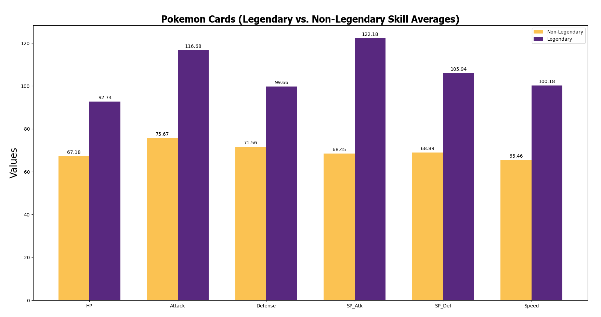
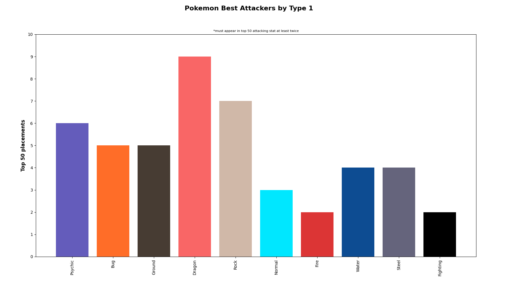
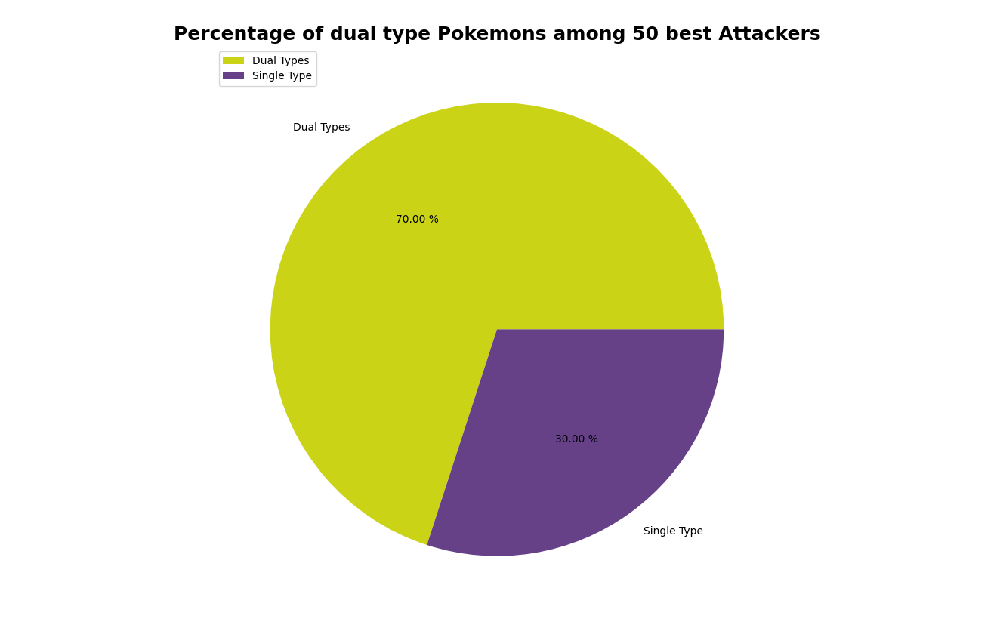
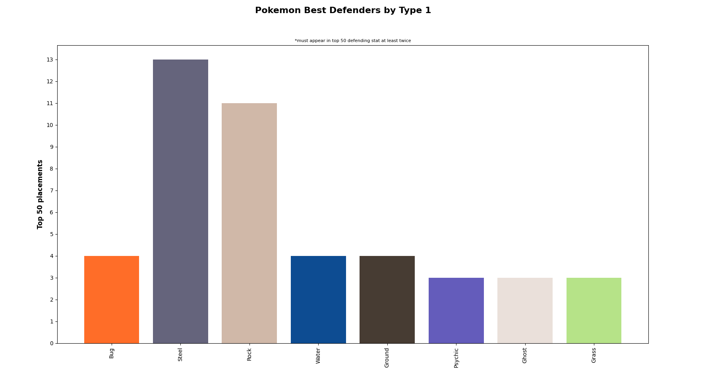
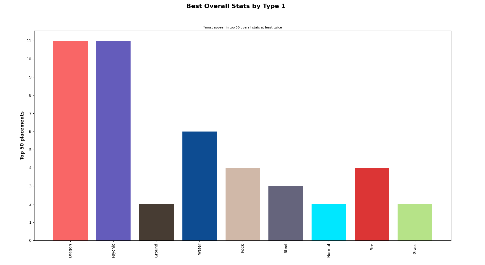

<strong>ABOUT</strong> 
A descriptive analytics of Pokemons with Python, Pandas and Matplotlib. Analysis based on the data chart from Kaggle.

<strong>DATA COVERED</strong> 
- Legendary vs Non-legendary stats
- Top 50 attackers by Type 1
- Top 50 defenders by Type 1
- Top 50 overall stats by Type 1
- Share of Double Types (Pokemons with both Type 1 and Type 2) among 50 best attackers
- Share of Double Types (Pokemons with both Type 1 and Type 2) among 50 best defenders
- Share of legendaries among 50 best attackers
- Share of legendaries among 50 best defenders 

<strong>NOTES</strong> 
Created in VS Code, so I split code into smaller modules for clarity and ease of navigation 

<strong>SCREENSHOTS</strong>

